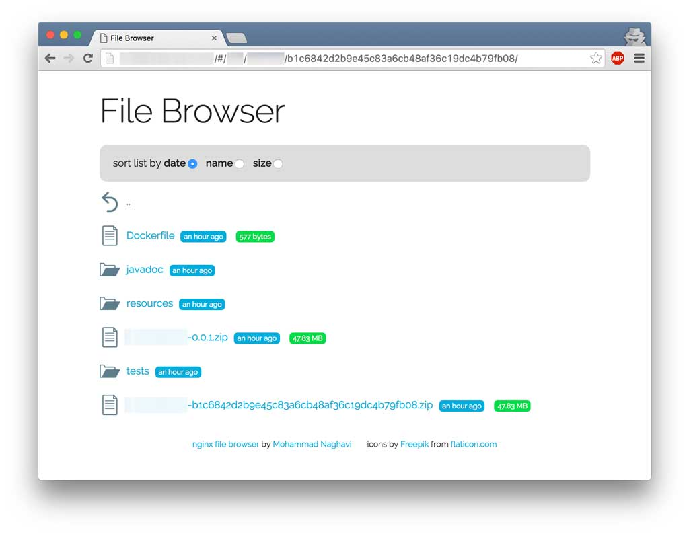

#nginx file browser
This web application is a very simple file browser which can be used
effectively together with [nginx's autoindex module](http://nginx.org/en/docs/http/ngx_http_autoindex_module.html).



A sample nginx configuration is also included which mounts **file browser** under root (`/`) and mounts files to be listed under `/files` path. Hence is the `filesBaseUrl` under

## Using with docker

Mainly for demonstration purposes a docker image is also available [here](https://hub.docker.com/r/mohamnag/nginx-file-browser/).
In order to use this docker image, the volume which has to be served should
be mounted under `/opt/www/files/` and port `80` of container shall be mapped
to a proper port on host. A proper run would look like:

```
$ docker run -p 8080:80 -v /path/to/my/files/:/opt/www/files/ mohamnag/nginx-file-browser
```

With container up and running you can point your browser to IP of docker host with given port to view the files. For example with above run command assuming docker host having IP with `192.168.0.200` we have to navigate to this URL:

`http://192.168.0.200:8080`


## Symlinks

> Be very careful with symlinks, they can expose very important files of system to outside world!

If you have symlinks inside files dir that you want to be able to browse too, the alias path where `/files` is served by nginx has to be changed to match the same path outside your docker container. Lets say I have a directory with path `/home/myuser/files-to-serve/`. Which has two directories named `dir1` and `dir2`. where `dir1` is nothing more than a symlink to `dir2`. In order to be able to browse `dir1` (inside `dir2`) on file browser, following have to be done:

Inside `default.conf` this line
```
    alias /opt/www/files/;
```

shall be changed to
```
    alias /home/myuser/files-to-serve/;
```

And the mounting point is now `/home/myuser/files-to-serve/` instead of `/opt/www/files/`.